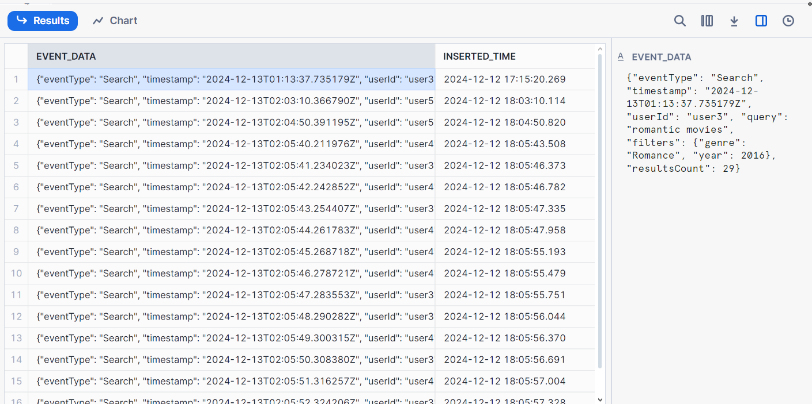

# Real-Time Clickstream Data Pipeline with Kafka and Snowflake

## Project Overview
This project demonstrates real-time migration of clickstream data using Kafka and Snowflake. A custom Python package generates random clickstream data, which is then streamed via Kafka and ingested into Snowflake for scalable storage and analytics. The Kafka broker runs on a Docker container, showcasing an efficient integration setup.


---

## Getting Started

### Prerequisites
- Docker installed on your machine.
- Python (3.7 or higher) installed with virtual environment support.
- Snowflake account for database integration.

---

## Setup Instructions

### 1. Clone the Repository
```bash
git clone https://github.com/Dev-Ansar/Real-Time-Clickstream-Data-Pipeline-with-Kafka-and-Snowflake.git
cd <repository-directory>
```

### 2. Start the Kafka Broker
Run the following command to start the Kafka broker:
```bash
docker-compose up
```

> **Note**: This setup uses a single broker configuration. Future updates will include multi-broker and multi-cluster setups for enhanced scalability and fault tolerance.


### 3. Activate Virtual Environment
Activate your Python virtual environment:

```bash
python -m venv env
source env/bin/activate  # On Linux/Mac
env\Scripts\activate     # On Windows
```


### 4. Install Required Libraries
Install the necessary Python libraries:

```bash
pip install kafka-python
pip install snowflake-connector-python
pip install python-dotenv
```


## Running the Project

### Step 1: Running the Producer
Run the producer script to start sending clickstream data:
```bash
python producer.py
```

> **Note**: If you are using Python 3.12 or later, you might encounter the following error:
```bash
ModuleNotFoundError: No module named 'kafka.vendor.six.moves'
```
Possible Fixes:
1. Install kafka-python-ng instead of kafka-python:
```bash
pip install kafka-python-ng
```

2. Replace the file contents at your_env\lib\site-packages\kafka\vendor\six.py with the latest version from [kafka-python GitHub](https://github.com/dpkp/kafka-python/blob/master/kafka/vendor/six.py)

After applying one of these fixes, re-run the producer script (I personally used fix 2).


### Step 2: Setting Up Snowflake
Retrieve your Snowflake account connection details and update them in the .env file.
These connection details are used in:
- snowflake_objects.py (for creating the database, schema, and tables)
- snowflake_consumer.py (for consuming and inserting data)


### Step 3: Running Snowflake Scripts
Create the necessary Snowflake objects:
```bash
python snowflake_objects.py
```

### Run the consumer script to ingest data into Snowflake:
```bash
python snowflake_consumer.py
```


### Verifying Data in Snowflake
Sign in to your Snowflake account and check the ingested data.


## Future Enhancements
Support for multi-broker and multi-cluster Kafka configurations.
Implement real-time processing of clickstream data before migration.
Add monitoring for data pipeline health and performance.

## 🤝 Contributing
Contributions are welcome! Feel free to submit issues or pull requests for new features or bug fixes.